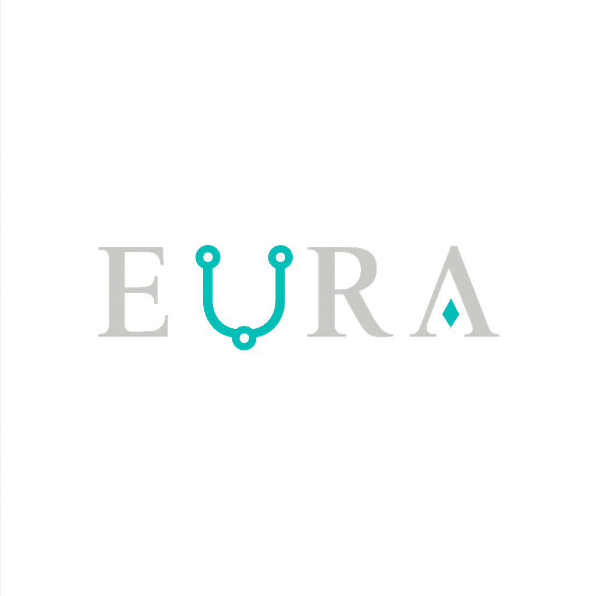

## Purpose

Eura is a new systems programming language designed to be safe, expressive, and performant, for those who think C++ and Rust aren't enough. It implements its own front-end and back-end, and doesn't rely on LLVM or any of its sub-projects. It's meant to have the minimal dependencies, and therefore it doesn't use third-party libraries.

## Requirements

- A 64-bits CPU & memory model.
- One of the following operating systems: Darwin (macOS), Windows, or Linux.
- CMake 4.1.0
- A GNU GCC, Clang (CL or GNU), or MSVC version capable of running C++26.

## Compilation

- Invoke your CMake with the CMakeLists.txt at the root directory of this repository as the source.
- Define CMAKE_BUILD_TYPE if you aren't using a multi-configuration with your generator of preferator, and if you do use multi-config, make sure to define a Debug or Release configuration.
- Optionally define EURA_TEST with ON to build the unit tests.